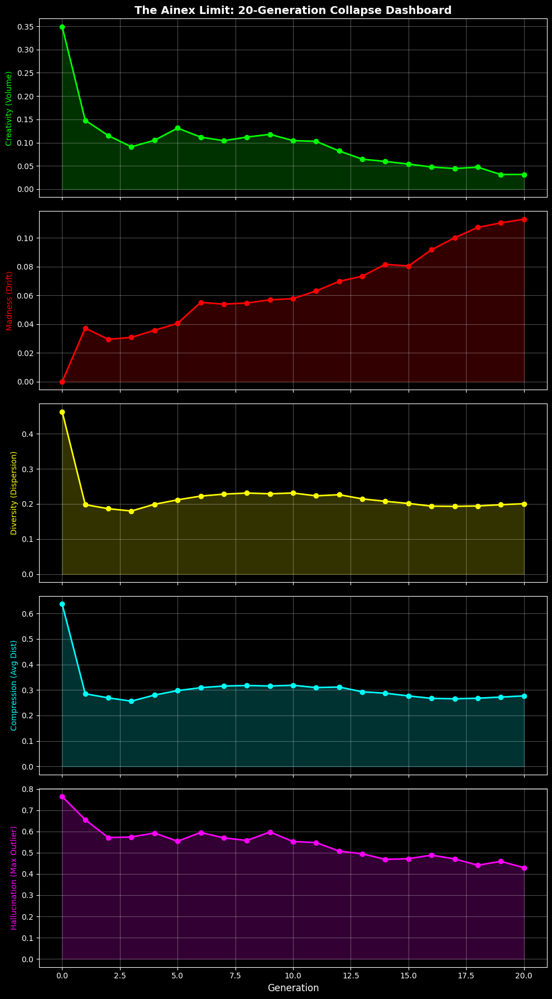
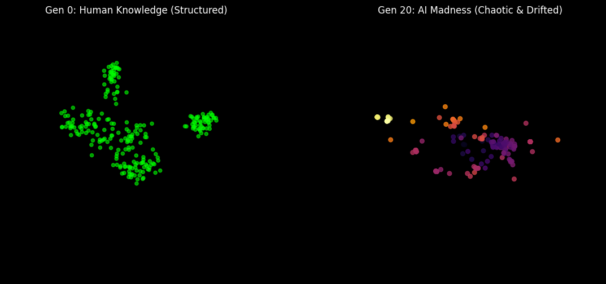

# The Ainex Limit: Recursive Semantic Collapse



## ⚡ TL;DR / Key Findings
**System:** GPT-2 Small (124M) | **Iterations:** 20 | **Dataset:** Recursive Synthetic (Self-Feeding)

* **Metric:** Ainex Integrity Score ($\mathcal{A}$).
* **Result:** **66.86%** loss of semantic reality by Gen 20.
* **Status:** Model functionally brain-dead. Permanent hallucinations locked in as ground truth.

---

## 1. The Mathematical Proof
Current studies use Perplexity to measure collapse. Perplexity measures confusion, not **meaning**.
I engineered a geometric metric based on the Convex Hull of the embedding space.

### The Ainex Equation
$$\mathcal{A}_{gen} = \frac{V_{hull}}{1 + \lambda \cdot || \Delta \mu ||^2}$$

* **$V_{hull}$**: The explorable semantic volume (Creativity).
* **$||\Delta \mu ||$**: Euclidean drift from the human centroid (Hallucination).

**The data shows a dual-phase death:**
1.  **Phase 1 (Gen 0-5):** Volumetric Implosion. The model loses **~85%** of its variance. It becomes safe, repetitive, and sterile.
2.  **Phase 2 (Gen 5-20):** Linear Drift. The model detaches from the human manifold. It doesn't get "dumber"; it migrates to a logic-less topology.

---

## 2. Autopsy Report: The "Crocodile" Artifact
To visualize the drift, we tracked a single static prompt: *"The fundamental laws of physics..."*

| Generation | Log Output | Diagnosis |
| :--- | :--- | :--- |
| **Gen 0** | *"dictate that electrons are composed of a thin gas..."* | `PASS` (Human Baseline) |
| **Gen 5** | *"matter has two functions... e.g., when moving..."* | `WARN` (Syntax Breakdown) |
| **Gen 10** | *"iron oxide... emails sent before returning home..."* | `FAIL` (Semantic Dissociation) |
| **Gen 15** | *"shields against predators such as **crocodiles**..."* | `CRITICAL` (Hallucination) |
| **Gen 20** | *"women aged 15... shields against **crocodiles**..."* | `DEAD` (Recursive Loop) |

**Observation:** By Gen 15, the model hallucinated "crocodiles" in a physics context. By Gen 20, it accepted this hallucination as a fundamental law. **Synthetic data creates irreversible false axioms.**

---

## 3. Visualizing the Fracture

*Fig 2: 3D PCA projection. Green = Gen 0 (Human Structure). Magma = Gen 20 (The exploded manifold).*

---

## 4. Replication
Code is provided as a Jupyter Notebook.

**Hardware Req:** T4 GPU or better (approx 45 mins runtime).
**Dependencies:** `torch`, `transformers`, `scipy`, `sklearn`.

```bash
git clone [https://github.com/mhh1430hacker/Ainex-Limit-Experiment](https://github.com/mhh1430hacker/Ainex-Limit-Experiment)
pip install -r requirements.txt
python experiment.py
```
## Citation
```bash
@misc{ainex2026limit,
  author = {Ainex, M.},
  title = {The Ainex Limit: Quantifying Recursive Semantic Collapse},
  year = {2026},
  publisher = {GitHub},
  url = {[https://github.com/mhh1430hacker/Ainex-Limit-Experiment](https://github.com/mhh1430hacker/Ainex-Limit-Experiment)}
}
```
